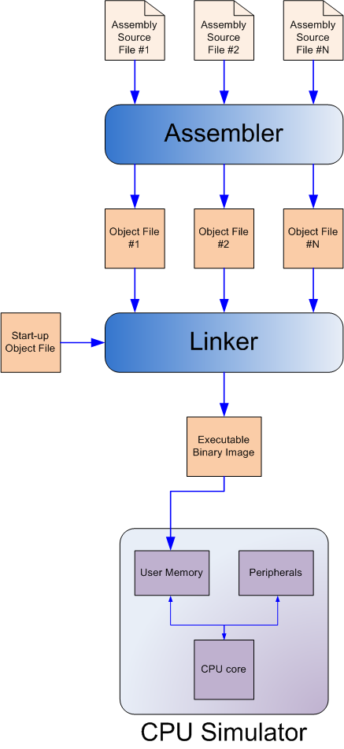

===================
 Luz user's manual
===================

:Author: Eli Bendersky
:Contact: eliben@gmail.com
:Date: 23-Apr-2010

.. contents:: Table of Contents
.. sectnum::

Introduction
************

The Luz suite
=============

Luz is an open-source CPU suite. Designing and implementing a CPU is not enough - one should have tools to program it. Since no one is willing to bang binary machine code by hand, the lowest tool required to program a CPU is some sort of an assembly language. Luz defines such an assembly language - LASM (Luz Assembly), and comes with a fully functional assembler that compiles assembly source code into an object file. However, for writing non-trivial programs this also isn't enough. Programs frequently consist of several assembly files, together will additional code packaged in libraries and provided by the system or 3rd parties. Therefore, a linker is required to collect all the object files together into an executable. This is why Luz also comes with a linker. The full suite, therefore, can be described by the following diagram:

But wait, aren't programs written in high-level languages these days? Yes, sure, and the Luz suite includes all the support required to program it in a higher-level language. All that's lacking is a compiler from C to LASM. Since Luz has a functional assembler and linker, it can readily support compilation from C. And C can be used to implement everything else. At the moment there's no C compiler for Luz, however, so LASM will have to do.

The Luz CPU
***********

Luz is a 32-bit RISC CPU. Its design was mostly inspired by MIPS, with some influence from Altera Nios II. In particular, the instruction set of Luz is quite similar to MIPS, and the assembly syntax and directives are very close to the facilities provided by MIPS assemblers.

Registers
=========

There are 32 registers in Luz, numbered R0-R31. Each register is 32 bits long. Some registers have special meaning for the CPU::

    R0  - Always contains 0. Writes to R0 are ignored.
    R30 - Reserved for future needs.
    R31 - Serves as the saved return address in CALL instructions.

When writing Luz assembly code, it is recommended to follow the guidelines for register usage described in (ZZZ - Implicit Hyperlink Target to EABI section on registers use).

Data width
==========

Luz is a 32-bit CPU. 32-bit quantities are *words*. 16-bit quantities are *halfwords*. 8-bit quantities are *bytes*.

Endianness
==========

Luz is little-endian: a word is stored in memory with its least-significant byte in the lower address.

Signed and unsigned
===================

Numeric quantities stored in the registers or instructions of Luz can be treated as either unsigned or signed.

* The unsigned integer range of an N-bit quantity is ``0..2**N - 1``.
* Signed integers are in 2s complement encoding. Their range is ``-2**(N-1)..2**(N-1) - 1``.

------------ 

Assembly programming and EABI
*****************************

Assembly syntax
===============

sdf

Directives
==========

dsf

------------ 

Appendix A. Instruction set 
***************************

Introduction
============

This section presents all the instructions supported by the Luz CPU. Some are not real instructions, but rather pseudo-instructions provided by the assembler and translated into other instructions (marked by ``(*)``). 

Some nomenclature::

    Rd          - destination register
    Rs, Rt      - source operand registers
    R<n>        - general-purpose register number <n>
    R<n>[i:j]   - bits [i:j] (inclusive) of R<n>
    <-          - denotes assignment
    PC          - program counter
    const<n>    - a constant (immediate) <n> bits long
                  Can be a mnemonic constant previously created with .define
    off<n>      - an offset <n> bits long used in load/store instructions.
                  Can be a mnemonic constant previously created with .define
                  Always treated as signed.
    mem<n>      - n-bit access to memory

``ADD`` - add 
=============

``ADD Rd, Rs, Rt                # Rd <- Rs + Rt``          

Addition is unsigned, without overflow detection. Signed numbers can be added with the same instruction, but the programmer is responsible for taking care of their ranges and possible overflows.

Encoding::

    31:26   Opcode = 000000
    25:21   Rd
    20:16   Rs
    15:11   Rt
    10:0    reserved

``ADDI`` - add immediate
========================

``ADDI Rd, Rs, const16          # Rd <- Rs + const16``

Addition is unsigned, without overflow detection. Signed numbers can be added with the same instruction, but the programmer is responsible for taking care of their ranges and possible overflows.

The constant is assumed to be unsigned. If you want to add a negative constant, subtract its absolute value instead.

Examples::

    addi $r8, $r7, 5        # $r8 <- $r7 + 5
    
    .define TWO, 2
    addi $r8, $r7, TWO      # $r8 <- $r7 + 2

Encoding::

    31:26   Opcode = 100000
    25:21   Rd
    20:16   Rs
    15:0    const16

``SUB`` - subtract
==================

``SUB Rd, Rs, Rt                # Rd <- Rs - Rt``

Subtraction is unsigned, without overflow detection. Signed numbers can be subtracted with the same instruction, but the programmer is responsible for taking care of their ranges and possible overflows.

Encoding::

    31:26   Opcode = 000001
    25:21   Rd
    20:16   Rs
    15:11   Rt
    10:0    reserved

``SUBI`` - subtract immediate
=============================

``SUBI Rd, Rs, const16          # Rd <- Rs - const16``

Subtraction is unsigned, without overflow detection. Signed numbers can be added with the same instruction, but the programmer is responsible for taking care of their ranges and possible overflows.

The constant is assumed to be unsigned. 

Encoding::

    31:26   Opcode = 100001
    25:21   Rd
    20:16   Rs
    15:0    const16

``NEG`` - negate (*)
====================

``NEG Rd, Rs                     # Rd <- -Rs``

Pseudo-instruction, translated to::

    SUB Rd, R0, Rs

``MULU`` - unsigned multiplication
==================================

``MULU Rd, Rs, Rt``

Multiplies ``Rs`` and ``Rt`` into a 64-bit result. Treats operands as unsigned. The lower 32 bits of the result are placed into ``Rd``, and the higher bits into ``R<d+1>``. If ``Rd`` is ``R31``, the higher bits are lost.

Example::

    mulu $r8, $r7, $r6          # $r8 <- ($r7 * $r6)[31:0]
                                # $r9 <- ($r7 * $r6)[63:32]

Encoding::

    31:26   Opcode = 000010
    25:21   Rd
    20:16   Rs
    15:11   Rt
    10:0    reserved

``MUL`` - signed multiplication
===============================

``MUL Rd, Rs, Rt``

Multiplies ``Rs`` and ``Rt`` into a 64-bit result. Treats operands as signed. The lower 32 bits of the result are placed into ``Rd``, and the higher bits into ``R<d+1>``. If ``Rd`` is ``R31``, the higher bits are lost.

Encoding::

    31:26   Opcode = 000010
    25:21   Rd
    20:16   Rs
    15:11   Rt
    10:0    reserved

``DIVU`` - unsigned division
============================

``DIVU Rd, Rs, Rt``

Divides ``Rs`` by ``Rt``. Treats operands as unsigned. The quotient of the division is placed into ``Rd``, and the remainder into ``R<d+1>``. If ``Rd`` is ``R31``, the remainder is lost.

Example::

    divu $r8, $r7, $r6          # $r8 <- quotient($r7 / $r6)
                                # $r9 <- remainder($r7 / $r6)

Encoding::

    31:26   Opcode = 000100
    25:21   Rd
    20:16   Rs
    15:11   Rt
    10:0    reserved

``DIV`` - signed division
=========================

``DIV Rd, Rs, Rt``

Divides ``Rs`` by ``Rt``. Treats operands as signed. The quotient of the division is placed into ``Rd``, and the remainder into ``R<d+1>``. If ``Rd`` is ``R31``, the remainder is lost.

Encoding::

    31:26   Opcode = 000101
    25:21   Rd
    20:16   Rs
    15:11   Rt
    10:0    reserved

``LUI`` - load upper immediate
==============================

``LUI Rd, const16               # Rd <- const16 << 16``

Loads the immediate into the upper halfword of ``Rd``. The lower halfword is set to 0.

Encoding::

    31:26   Opcode = 000110
    25:21   Rd
    20:16   reserved
    15:0    const16

``LLI`` - load lower immediate (*)
==================================

``LLI Rd, const16               # Rd <- const16``

Loads the immediate into the lower halfword of ``Rd``. The upper halfword is set to 0.

Pseudo-instruction, translated to::

    ORI Rd, R0, const16

``LI`` - load immediate (*)
===========================

``LI Rd, const32                # Rd <- const32``

Pseudo-instruction, translated to::

    LUI Rd, const32[31:16]
    ORI Rd, Rd, const32[15:0]

``MOVE`` - move data between registers (*)
==========================================

``MOVE Rd, Rs                   # Rd <- Rs``

Pseudo-instruction, translated to::

    ADD Rd, Rs, R0

``SLL`` - shift left logical
============================

``SLL Rd, Rs, Rt                # Rd <- Rs << Rt[4:0]``

``Rd`` is assigned the value of ``Rs`` shifted left by the value of the 5 lower bits of ``Rt``. 0 is shifted into the lower bits of ``Rd``. 

Encoding::

    31:26   Opcode = 000111
    25:21   Rd
    20:16   Rs
    15:11   Rt
    10:0    reserved

``SLLI`` - shift left logical immediate
=======================================

``SLLI Rd, Rs, const16          # Rd <- Rs << const16[4:0]``

``Rd`` is assigned the value of ``Rs`` shifted left by the value of the 5 lower bits of ``const16``. 0 is shifted into the lower bits of ``Rd``. 

Encoding::

    31:26   Opcode = 101011
    25:21   Rd
    20:16   Rs
    15:0    const16

``SRL`` - shift right logical
=============================

``SRL Rd, Rs, Rt                # Rd <- Rs >> Rt[4:0]``

``Rd`` is assigned the value of ``Rs`` shifted right by the value of the 5 lower bits of ``Rt``. 0 is shifted into the higher bits of ``Rd``. 

Encoding::

    31:26   Opcode = 001000
    25:21   Rd
    20:16   Rs
    15:11   Rt
    10:0    reserved

``SRLI`` - shift right logical immediate
========================================

``SRLI Rd, Rs, const16          # Rd <- Rs >> const16[4:0]``

``Rd`` is assigned the value of ``Rs`` shifted right by the value of the 5 lower bits of ``const16``. 0 is shifted into the higher bits of ``Rd``. 

Encoding::

    31:26   Opcode = 101100
    25:21   Rd
    20:16   Rs
    15:0    const16

``AND`` - bitwise and
=====================

``AND Rd, Rs, Rt                # Rd <- Rs & Rt``

Bitwise and of the registers ``Rs`` and ``Rt``.

Encoding::

    31:26   Opcode = 001001
    25:21   Rd
    20:16   Rs
    15:11   Rt
    10:0    reserved

``ANDI`` - bitwise and with immediate
=====================================

``ANDI Rd, Rs, const16          # Rd <- Rs & const16``

Bitwise and of ``Rs`` with the zero-extended immediate.

Encoding::

    31:26   Opcode = 101001
    25:21   Rd
    20:16   Rs
    15:0    const16

``OR`` - bitwise or
===================

``OR Rd, Rs, Rt                # Rd <- Rs | Rt``

Bitwise or of the registers ``Rs`` and ``Rt``.

Encoding::

    31:26   Opcode = 001010
    25:21   Rd
    20:16   Rs
    15:11   Rt
    10:0    reserved

``ORI`` - bitwise or with immediate
===================================

``ORI Rd, Rs, const16          # Rd <- Rs | const16``

Bitwise or of ``Rs`` with the zero-extended immediate.

Encoding::

    31:26   Opcode = 101010
    25:21   Rd
    20:16   Rs
    15:0    const16

``NOT`` - bitwise not (*)
=========================

``NOT Rd, Rs                    # Rd <- ~Rs``

Pseudo-instruction, translated to::

    NOR Rd, Rs, Rs

``NOR`` - bitwise nor
=====================

``NOR Rd, Rs, Rt                # Rd <- ~(Rs | Rt)``

Bitwise nor of the registers ``Rs`` and ``Rt``.

Encoding::

    31:26   Opcode = 001011
    25:21   Rd
    20:16   Rs
    15:11   Rt
    10:0    reserved

``XOR`` - bitwise xor
=====================

``XOR Rd, Rs, Rt                # Rd <- Rs ^ Rt``

Bitwise xor of the registers ``Rs`` and ``Rt``.

Encoding::

    31:26   Opcode = 001100
    25:21   Rd
    20:16   Rs
    15:11   Rt
    10:0    reserved

``LB`` - load signed byte 
=========================

``LB Rd, off16(Rs)              # Rd <- mem8(Rs + off16)``

Load byte from memory into the lower byte of Rd. Sign-extend into the higher bits.

Encoding::

    31:26   Opcode = 001101
    25:21   Rd
    20:16   Rs
    15:0    off16

``LBU`` - load unsigned byte
============================

``LBU Rd, off16(Rs)             # Rd <- mem8(Rs + off16)``

Load byte from memory into the lower byte of Rd. Zero-extend into the higher bits.

Encoding::

    31:26   Opcode = 010000
    25:21   Rd
    20:16   Rs
    15:0    off16

``LH`` - load signed halfword
=============================

``LH Rd, off16(Rs)              # Rd <- mem16(Rs + off16)``

Load halfword from memory into the lower halfword of Rd. Sign-extend into the higher bits.

Encoding::

    31:26   Opcode = 001110
    25:21   Rd
    20:16   Rs
    15:0    off16

``LHU`` - load unsigned halfword
================================

``LHU Rd, off16(Rs)             # Rd <- mem16(Rs + off16)``

Load halfword from memory into the lower halfword of Rd. Zero-extend into the higher bits.

Encoding::

    31:26   Opcode = 010001
    25:21   Rd
    20:16   Rs
    15:0    off16

``LW`` - load word
==================

``LW Rd, off16(Rs)              # Rd <- mem32(Rs + off16)``

Load word from memory into Rd.

Encoding::

    31:26   Opcode = 001111
    25:21   Rd
    20:16   Rs
    15:0    off16

``SB`` - store byte
===================

``SB Rs, off16(Rd)              # mem8(Rd + off16) <- Rs[7:0]``

Store the lower byte of ``Rs`` into memory.

Encoding::

    31:26   Opcode = 010010
    25:21   Rd
    20:16   Rs
    15:0    off16

``SH`` - store halfword
=======================

``SH Rs, off16(Rd)              # mem16(Rd + off16) <- Rs[15:0]``

Store the lower halfword of ``Rs`` into memory.

Encoding::

    31:26   Opcode = 010011
    25:21   Rd
    20:16   Rs
    15:0    off16

``SW`` - store word
===================

``SW Rs, off16(Rd)              # mem32(Rd + off16) <- Rs[31:0]``

Store the ``Rs`` into memory.

Encoding::

    31:26   Opcode = 010100
    25:21   Rd
    20:16   Rs
    15:0    off16

``JR`` - jump to register
=========================

``JR Rd                         # PC <- Rd``

Jump to the address stored in ``Rd``.

Encoding::

    31:26   Opcode = 010110
    25:21   Rd
    20:0    reserved

``CALL`` - call subroutine
==========================

``CALL const26                  # R31 <- PC + 4; PC <- const26 * 4``

Procedure call. Save the address of the next instruction in ``R31`` and jump unconditionally to the address ``const26 * 4`` (instructions are aligned on word boundaries). ``const26`` is treated as unsigned.

Encoding::

    31:26   Opcode = 011101
    25:0    const26

``B`` - unconditional branch
============================

``B off26                       # PC <- PC + off26 * 4``

The offset is relative to the program counter. ``off26`` is treated as signed. 

Encoding::

    31:26   Opcode = 010101
    25:0    off26

``BEQ`` - branch when equal
===========================

``BEQ Rd, Rs, off16             # if Rd == Rs then PC <- PC + off16 * 4``

The offset is relative to the program counter. ``off16`` is treated as signed.

Encoding::

    31:26   Opcode = 010111
    25:21   Rd
    20:16   Rs
    15:0    off16

``BEQZ`` - branch when equal zero (*)
=====================================

``BEQZ Rd, off16                # if Rd == 0 then PC <- PC + off16 * 4``

Pseudo-instruction, translated to::

    BEQ Rd, R0, off16

``BNE`` - branch when not equal
===============================

``BNE Rd, Rs, off16             # if Rd != Rs then PC <- PC + off16 * 4``

The offset is relative to the program counter. ``off16`` is treated as signed.

Encoding::

    31:26   Opcode = 011000
    25:21   Rd
    20:16   Rs
    15:0    off16

``BNEZ`` - branch when not equal zero (*)
=========================================

``BNEZ Rd, off16                # if Rd != 0 then PC <- PC + off16 * 4``

Pseudo-instruction, translated to::

    BNE Rd, R0, off16

``BGE`` - branch when greater or equal, signed
==============================================

``BGE Rd, Rs, off16             # if Rd >= Rs then PC <- PC + off16 * 4``

The comparison operands are treated as signed. The offset is relative to the program counter. ``off16`` is treated as signed.

Encoding::

    31:26   Opcode = 011001
    25:21   Rd
    20:16   Rs
    15:0    off16

``BGEU`` - branch when greater or equal, unsigned
=================================================

``BGEU Rd, Rs, off16            # if Rd >= Rs then PC <- PC + off16 * 4``

The comparison operands are treated as unsigned. The offset is relative to the program counter. ``off16`` is treated as signed.

Encoding::

    31:26   Opcode = 100010
    25:21   Rd
    20:16   Rs
    15:0    off16

``BGT`` - branch when greater than, signed
==========================================

``BGT Rd, Rs, off16             # if Rd > Rs then PC <- PC + off16 * 4``

The comparison operands are treated as signed. The offset is relative to the program counter. ``off16`` is treated as signed.

Encoding::

    31:26   Opcode = 011010
    25:21   Rd
    20:16   Rs
    15:0    off16

``BGTU`` - branch when greater than, unsigned
=============================================

``BGTU Rd, Rs, off16            # if Rd > Rs then PC <- PC + off16 * 4``

The comparison operands are treated as unsigned. The offset is relative to the program counter. ``off16`` is treated as signed.

Encoding::

    31:26   Opcode = 100011
    25:21   Rd
    20:16   Rs
    15:0    off16

``BLE`` - branch when less or equal, signed
===========================================

``BLE Rd, Rs, off16             # if Rd <= Rs then PC <- PC + off16 * 4``

The comparison operands are treated as signed. The offset is relative to the program counter. ``off16`` is treated as signed.

Encoding::

    31:26   Opcode = 011011
    25:21   Rd
    20:16   Rs
    15:0    off16

``BLEU`` - branch when less or equal, unsigned
==============================================

``BLEU Rd, Rs, off16            # if Rd <= Rs then PC <- PC + off16 * 4``

The comparison operands are treated as unsigned. The offset is relative to the program counter. ``off16`` is treated as signed.

Encoding::

    31:26   Opcode = 100100
    25:21   Rd
    20:16   Rs
    15:0    off16

``BLT`` - branch when less than, signed
=======================================

``BLT Rd, Rs, off16             # if Rd < Rs then PC <- PC + off16 * 4``

The comparison operands are treated as signed. The offset is relative to the program counter. ``off16`` is treated as signed.

Encoding::

    31:26   Opcode = 011100
    25:21   Rd
    20:16   Rs
    15:0    off16

``BLTU`` - branch when less than, unsigned
==========================================

``BLTU Rd, Rs, off16            # if Rd < Rs then PC <- PC + off16 * 4``

The comparison operands are treated as unsigned. The offset is relative to the program counter. ``off16`` is treated as signed.

Encoding::

    31:26   Opcode = 100101
    25:21   Rd
    20:16   Rs
    15:0    off16

``RET`` - return from subroutine (*)
====================================

``RET                           # PC <- R31``

Pseudo-instruction, translated to::

    JR R31

``ERET`` - return from exception
================================

``ERET                          # PC <- saved exception return address``

Returns from an exception handler. The PC is set to the address from which the CPU will resume execution (this address is saved internally by the CPU when an exception occurs).

``NOP`` - no operation (*)
==========================

``NOP``

Pseudo-instruction, translated to::

    ADD R0, R0, R0

``HALT`` - halt the CPU
=======================

``HALT``

Halts the CPU. A hardware 'halt' line is asserted, and the CPU has to be reset to run again.

Encoding::

    31:26   Opcode = 111111
    25:0    reserved

